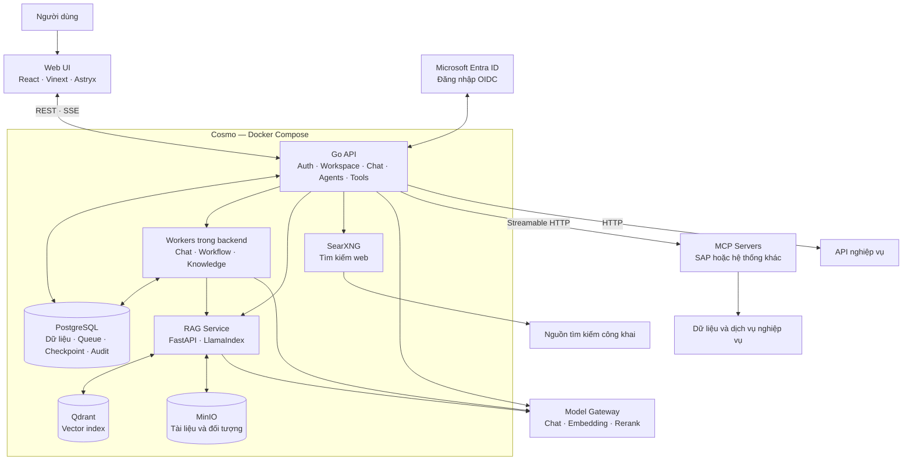
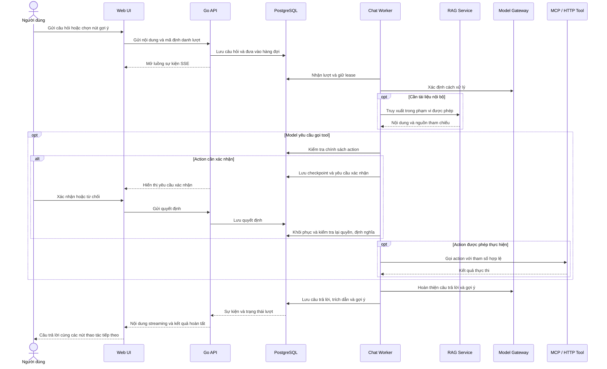

<p align="center">
  
</p>

<h1 align="center">Cosmo</h1>

<p align="center"><strong>Nền tảng AI nội bộ cho doanh nghiệp</strong></p>
<p align="center">Chat · Knowledge Base · Agents · MCP Tools · Workflows</p>

<p align="center">
  
  
  
  
  
  
</p>

<p align="center">
  <a href="#tổng-quan">Tổng quan</a> ·
  <a href="#kiến-trúc">Kiến trúc</a> ·
  <a href="#khởi-động-nhanh">Khởi động nhanh</a> ·
  <a href="#cấu-hình">Cấu hình</a> ·
  <a href="#phát-triển-và-kiểm-thử">Kiểm thử</a>
</p>

## Tổng quan

Cosmo cung cấp một không gian làm việc chung để nhân viên trò chuyện với AI, tra cứu tài liệu nội bộ và sử dụng các công cụ nghiệp vụ. Tổ chức quản lý model, dữ liệu, thành viên và các kết nối trong từng workspace.

Hệ thống có thể tự triển khai bằng Docker Compose. Model được cung cấp qua một **Model Gateway tương thích OpenAI**; tài liệu được xử lý bởi dịch vụ RAG riêng; các hệ thống như SAP được kết nối qua **MCP server độc lập**.

## Tính năng chính

- **Workspace và tài khoản** — đăng nhập cục bộ hoặc Microsoft Entra ID, quản lý thành viên, vai trò và chuyển workspace.
- **Chat** — trả lời streaming, lịch sử hội thoại, tệp đính kèm, trích dẫn nguồn, hiển thị lời gọi tool và nút gợi ý tiếp theo. Tin nhắn giữ nguyên xuống dòng.
- **Knowledge Base** — nhập và lập chỉ mục tài liệu, truy xuất theo quyền workspace, snapshot dữ liệu và bộ công cụ đánh giá chất lượng truy xuất.
- **Agents** — cấu hình chỉ dẫn, model, kiến thức, tool và phiên bản phát hành; thử agent trước khi sử dụng.
- **Tools và MCP** — công cụ tích hợp sẵn, HTTP API và MCP Streamable HTTP; khám phá action, lưu JSON Schema, thử gọi và quản lý chính sách từng action.
- **Workflows** — thiết kế luồng xử lý, thực thi bằng worker, theo dõi từng bước và lưu trạng thái khi chờ xác nhận.
- **Quản trị và quan sát** — quản lý gateway, cấu hình hệ thống, nhật ký audit, lịch sử thực thi và thống kê sử dụng model.

## Kiến trúc

### Các lớp hệ thống

| Lớp | Công nghệ | Trách nhiệm |
| --- | --- | --- |
| Web | React 19, TypeScript, Vinext, Astryx, Tailwind CSS | Chat, workspace, agent, tool, workflow và giao diện quản trị |
| API và điều phối | Go 1.26, Chi | Xác thực, phân quyền, xử lý hội thoại, gọi model/tool và API nghiệp vụ |
| Xử lý nền | Go workers, PostgreSQL | Hàng đợi chat/workflow, nhập tài liệu, checkpoint và khôi phục trạng thái |
| Knowledge | Python 3.12, FastAPI, LlamaIndex | Đọc tài liệu, chia đoạn và truy xuất nội dung |
| Dữ liệu ứng dụng | PostgreSQL 17 | Người dùng, workspace, hội thoại, cấu hình, chính sách và lịch sử thực thi |
| Vector và tệp | Qdrant, MinIO | Chỉ mục vector và lưu trữ đối tượng |
| Tích hợp | Model Gateway, MCP, HTTP, SearXNG | Suy luận AI, kết nối nghiệp vụ và tìm kiếm web |
| Triển khai | Docker Compose | Chạy các service và lưu dữ liệu bằng volume |

### Sơ đồ tổng thể



PostgreSQL lưu cả dữ liệu ứng dụng và trạng thái hàng đợi; cấu hình Compose hiện tại không có Redis hay một service worker riêng. Gateway và MCP server là các hệ thống bên ngoài, không được khởi tạo bởi Compose mặc định.

### Luồng xử lý một lượt chat



## Khởi động nhanh

### Yêu cầu

- Docker Engine hoặc Docker Desktop với Docker Compose v2.
- PowerShell để sử dụng script trong `scripts/`.
- Kết nối tới Model Gateway để sử dụng các tính năng AI.
- Lần build đầu cần truy cập registry và kho package để tải image, dependency.

### 1. Tạo cấu hình

Từ thư mục gốc repository, nếu chưa có `.env`:

```powershell
Copy-Item .env.example .env
```

Chỉnh `.env` trước khi chạy:

- Thay `POSTGRES_PASSWORD` và cập nhật mật khẩu tương ứng trong `DATABASE_URL`.
- Đặt `SESSION_SECRET`, `ADMIN_PASSWORD`, `MINIO_SECRET_KEY` và `SEARXNG_SECRET` bằng giá trị riêng.
- Cấu hình Model Gateway và Microsoft Entra ID nếu sử dụng.

Danh sách biến và chú thích đầy đủ nằm trong [.env.example](.env.example). Không ghi đè `.env` đang dùng bằng file mẫu.

### 2. Build và khởi động

```powershell
.\scripts\start-local.ps1
```

Script chạy `docker compose up -d --build`. Đây là lệnh **có build**, không phải chế độ chạy hoàn toàn offline.

Nếu đã có đầy đủ image local và chỉ muốn khởi động chúng:

```powershell
docker compose up -d --no-build --pull never
```

### 3. Truy cập

| Dịch vụ | Địa chỉ local |
| --- | --- |
| Giao diện Cosmo | [localhost:3100](http://localhost:3100) |
| API health | [localhost:8080/api/health](http://localhost:8080/api/health) |
| RAG health | [localhost:8001/health](http://localhost:8001/health) |
| PostgreSQL | `localhost:55432` |
| Qdrant | [localhost:6333](http://localhost:6333) |
| MinIO Console | [localhost:9011](http://localhost:9011) |
| MinIO S3 API | `localhost:9010` |

SearXNG chỉ mở trong mạng Compose, không công bố cổng ra host.

### Dừng và xem trạng thái

```powershell
docker compose ps
docker compose logs --tail=100 backend
.\scripts\stop-local.ps1
```

Dừng bình thường giữ các volume `cosmo-postgres`, `cosmo-qdrant`, `cosmo-minio`. Tùy chọn `start-local.ps1 -ResetData` xóa cả ba volume; chỉ dùng khi chủ động muốn bỏ toàn bộ dữ liệu local.

## Cấu hình

### Model Gateway

Có thể cấu hình gateway theo workspace trong giao diện hoặc dùng các biến môi trường:

```dotenv
LLM_BASE_URL=https://gateway.example.com/v1
LLM_API_KEY=<gateway-api-key>
LLM_MODEL=<model-alias>
LLM_REQUEST_TIMEOUT=90s
```

Gateway cần cung cấp API tương thích OpenAI Chat Completions. Chọn model hỗ trợ tool calling khi dùng MCP/HTTP tools; cấu hình model embedding và rerank phù hợp khi dùng Knowledge Base. Khóa gateway được sử dụng ở phía server, không đưa vào biến `NEXT_PUBLIC_*`.

### Microsoft Entra ID

Đăng ký ứng dụng Web với redirect URI local:

```text
http://localhost:8080/api/auth/entra/callback
```

Điền `AZURE_AD_TENANT_ID`, `AZURE_AD_CLIENT_ID`, `AZURE_AD_CLIENT_SECRET` và `AZURE_AD_REDIRECT_URL` trong `.env`. Khi Entra được bật, đăng nhập/đăng ký bằng mật khẩu cục bộ bị tắt. `ADMIN_EMAILS` dùng để chỉ định quản trị viên; permission Microsoft Graph `User.Read` phục vụ ảnh đại diện.

### MCP và quyền gọi tool

1. Tạo tool loại MCP, nhập endpoint và cấu hình xác thực.
2. Chạy **Discover MCP tools**, kiểm tra schema và thử action.
3. Chọn chính sách từng action: **Chỉ đọc**, **Chủ tool xác nhận**, **Người sử dụng xác nhận** hoặc **Chặn action**.
4. Cài tool vào workspace và bật **Callable in chat** để sử dụng trong chat thường; hoặc gắn tool vào agent.

Tool dùng khóa chung vẫn có thể được gọi trong workspace khi được bật và chính sách action cho phép. OAuth theo người dùng yêu cầu từng người kết nối tài khoản của mình. MCP server vẫn chịu trách nhiệm xác thực và phân quyền tại hệ thống đích.

Discover giữ chính sách cho action không đổi; thay đổi định nghĩa action hoặc thông tin xác thực có thể yêu cầu duyệt lại. Lưu thông tin chung và publish không tự làm mất chính sách “Chỉ đọc”.

Đối với endpoint nội bộ, cấu hình `TOOL_EGRESS_ALLOWED_HOSTS` theo hostname cần truy cập. Hướng dẫn giao thức, các profile OAuth và MCP demo nằm tại [MCP integration](docs/mcp-integration.md).

## Phát triển và kiểm thử

Phát triển ngoài container cần Go 1.26+, Node.js 22.13+ và Python 3.12 cho RAG.

**Backend** — chạy từ `backend/`:

```powershell
go test ./...
```

Các test tích hợp PostgreSQL chỉ chạy khi có `COSMO_TEST_DATABASE_URL`. Dùng database kiểm thử riêng đã chạy migration; không trỏ test vào database đang phục vụ người dùng vì worker có thể nhận nhầm các job fixture.

**Frontend** — chạy từ `frontend/`:

```powershell
npm ci
node --test tests/*.test.mjs
npm run build
```

**RAG** — khi service đang chạy:

```powershell
docker compose exec -T rag python -m pytest tests
```

**Kiểm tra cấu hình Compose** — chạy từ thư mục gốc:

```powershell
docker compose config --quiet
```

## Cấu trúc repository

```text
backend/
  cmd/                     Server, migrate, seed và MCP demo
  internal/
    agents/                Agent, phiên bản và hỗ trợ hội thoại
    httpapi/               REST, SSE, auth và điều phối worker
    tools/                 HTTP/MCP, discovery, OAuth và chính sách
    knowledge/             Client và hợp đồng với dịch vụ RAG
    modelgateway/          Client model, context budget và usage
    workflows/             Định nghĩa và thực thi workflow
    runs/                  Run, step và sự kiện thực thi
    database/              Schema và migrations
frontend/
  app/                     Giao diện và API client
  public/                  Logo và tài nguyên tĩnh
  tests/                   Kiểm thử frontend
rag-service/
  app/                     Parsing, indexing và retrieval
  eval/                    Bộ câu hỏi và báo cáo đánh giá
  tests/                   Kiểm thử RAG
scripts/                   Script local và đánh giá chat retrieval
searxng/                   Cấu hình tìm kiếm web
docs/                      Tài liệu tích hợp và vận hành
docker-compose.yml         Bảy service mặc định
docker-compose.mcpdemo.yml  MCP demo tùy chọn
.env.example               Cấu hình mẫu
```

## Dữ liệu và triển khai

- `.env` và credential local không được commit. Thay toàn bộ secret mẫu trước khi triển khai.
- Khi chạy ngoài máy phát triển, bật HTTPS, đặt `COOKIE_SECURE=true` và cấu hình origin/redirect URI theo domain thực tế.
- Giới hạn truy cập các cổng PostgreSQL, Qdrant, MinIO và RAG theo mạng triển khai.
- Sao lưu PostgreSQL cùng dữ liệu MinIO/Qdrant; không coi việc container còn tồn tại là đã có bản sao lưu.
- Lượt tool bị gián đoạn sau dispatch không được tự động phát lại nếu chưa xác định kết quả; kiểm tra lịch sử và đối soát tại hệ thống đích.

## Tài liệu liên quan

- [Tích hợp MCP, OAuth và conformance test](docs/mcp-integration.md)
- [Chính sách tool và lịch sử triển khai cơ chế xác nhận](docs/tool-write-policy.md)
- [Đánh giá truy xuất trong chat](docs/evaluation-chat-retrieval.md)
- [Hướng dẫn gán nhãn bộ câu hỏi đánh giá](docs/evaluation-chat-retrieval-labeling.md)
- [Kế hoạch cải tiến chat, agent và Knowledge Base](docs/ke-hoach-cai-tien-chat-agent-knowledge-base.md)

Các tài liệu kế hoạch và ghi nhận theo ngày mô tả cả những giai đoạn trước đây; đối chiếu code hiện tại khi đánh giá trạng thái một tính năng.
