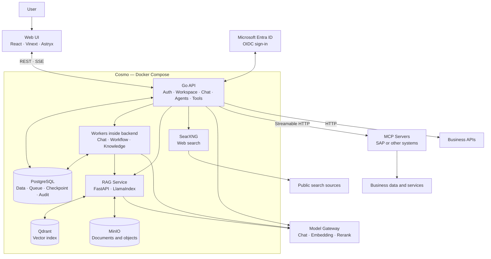
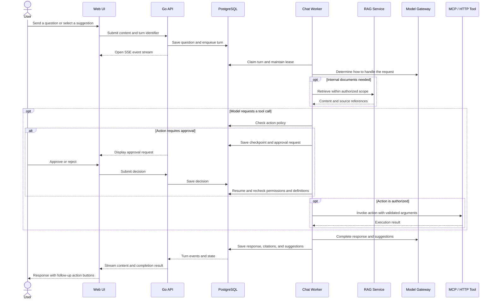

<p align="center">
  
</p>

<h1 align="center">Cosmo</h1>

<p align="center"><a href="README.md">English</a> · <a href="README.vi.md">Tiếng Việt</a></p>

<p align="center"><strong>An internal AI platform for enterprises</strong></p>
<p align="center">Chat · Knowledge Base · Agents · MCP Tools · Workflows</p>

<p align="center">
  
  
  
  
  
  
</p>

<p align="center">
  <a href="#overview">Overview</a> ·
  <a href="#architecture">Architecture</a> ·
  <a href="#quick-start">Quick start</a> ·
  <a href="#configuration">Configuration</a> ·
  <a href="#development-and-testing">Testing</a>
</p>

## Overview

Cosmo provides a shared workspace where employees can chat with AI, search internal documents, and use business tools. Organizations manage models, data, members, and integrations within each workspace.

The platform can be self-hosted with Docker Compose. Models are accessed through an **OpenAI-compatible Model Gateway**, documents are processed by a dedicated RAG service, and systems such as SAP connect through **independent MCP servers**.

## Key features

- **Workspaces and accounts** — local or Microsoft Entra ID sign-in, membership management, roles, and workspace switching.
- **Chat** — streaming responses, conversation history, attachments, source citations, tool call details, and follow-up buttons. Messages preserve line breaks.
- **Knowledge Base** — document ingestion and indexing, retrieval scoped to workspace permissions, data snapshots, and retrieval evaluation tools.
- **Agents** — configure instructions, models, knowledge, tools, and published versions; try agents before using them.
- **Tools and MCP** — built-in tools, HTTP APIs, and MCP Streamable HTTP; discover actions, store JSON Schema, test calls, and manage policies for each action.
- **Workflows** — design flows, execute them through workers, monitor individual steps, and save checkpoints while awaiting approval.
- **Administration and observability** — gateway management, system configuration, audit logs, execution history, and model usage statistics.

## Architecture

### System layers

| Layer | Technology | Responsibility |
| --- | --- | --- |
| Web | React 19, TypeScript, Vinext, Astryx, Tailwind CSS | Chat, workspaces, agents, tools, workflows, and administration UI |
| API and orchestration | Go 1.26, Chi | Authentication, authorization, conversation handling, model/tool calls, and business APIs |
| Background processing | Go workers, PostgreSQL | Chat/workflow queues, document ingestion, checkpoints, and recovery |
| Knowledge | Python 3.12, FastAPI, LlamaIndex | Document parsing, chunking, and content retrieval |
| Application data | PostgreSQL 17 | Users, workspaces, conversations, configuration, policies, and execution history |
| Vectors and files | Qdrant, MinIO | Vector indexes and object storage |
| Integrations | Model Gateway, MCP, HTTP, SearXNG | AI inference, business integrations, and web search |
| Deployment | Docker Compose | Service execution and persistent volumes |

### System overview



PostgreSQL stores both application data and queue state. The current Compose configuration has no Redis or separate worker service. The Model Gateway and MCP servers are external systems and are not provisioned by the default Compose stack.

### Chat turn lifecycle



## Quick start

### Requirements

- Docker Engine or Docker Desktop with Docker Compose v2.
- PowerShell to run the scripts in `scripts/`.
- Access to a Model Gateway for AI features.
- Registry and package repository access for the initial image and dependency build.

### 1. Create configuration

From the repository root, if `.env` does not already exist:

```powershell
Copy-Item .env.example .env
```

Edit `.env` before starting:

- Replace `POSTGRES_PASSWORD` and update the matching password in `DATABASE_URL`.
- Set unique values for `SESSION_SECRET`, `ADMIN_PASSWORD`, `MINIO_SECRET_KEY`, and `SEARXNG_SECRET`.
- Configure the Model Gateway and Microsoft Entra ID if used.

See [.env.example](.env.example) for the complete variable list and comments. Do not overwrite an existing `.env` with the sample file.

### 2. Build and start

```powershell
.\scripts\start-local.ps1
```

The script runs `docker compose up -d --build`. It **builds images** and is not a fully offline startup mode.

If all required images are already available locally and you only want to start them:

```powershell
docker compose up -d --no-build --pull never
```

### 3. Access services

| Service | Local address |
| --- | --- |
| Cosmo UI | [localhost:3100](http://localhost:3100) |
| API health | [localhost:8080/api/health](http://localhost:8080/api/health) |
| RAG health | [localhost:8001/health](http://localhost:8001/health) |
| PostgreSQL | `localhost:55432` |
| Qdrant | [localhost:6333](http://localhost:6333) |
| MinIO Console | [localhost:9011](http://localhost:9011) |
| MinIO S3 API | `localhost:9010` |

SearXNG is available only within the Compose network and does not publish a host port.

### Stop and inspect status

```powershell
docker compose ps
docker compose logs --tail=100 backend
.\scripts\stop-local.ps1
```

Normal shutdown preserves the `cosmo-postgres`, `cosmo-qdrant`, and `cosmo-minio` volumes. The `start-local.ps1 -ResetData` option deletes all three volumes; use it only when you intend to discard all local data.

## Configuration

### Model Gateway

Configure the gateway per workspace in the UI or through environment variables:

```dotenv
LLM_BASE_URL=https://gateway.example.com/v1
LLM_API_KEY=<gateway-api-key>
LLM_MODEL=<model-alias>
LLM_REQUEST_TIMEOUT=90s
```

The gateway must provide an OpenAI-compatible Chat Completions API. Choose a model that supports tool calling for MCP/HTTP tools, and configure suitable embedding and reranking models for the Knowledge Base. Gateway keys are used on the server; do not expose them through `NEXT_PUBLIC_*` variables.

### Microsoft Entra ID

Register a Web application with the local redirect URI:

```text
http://localhost:8080/api/auth/entra/callback
```

Set `AZURE_AD_TENANT_ID`, `AZURE_AD_CLIENT_ID`, `AZURE_AD_CLIENT_SECRET`, and `AZURE_AD_REDIRECT_URL` in `.env`. Enabling Entra disables local password sign-in and registration. Use `ADMIN_EMAILS` to designate administrators; the Microsoft Graph `User.Read` permission supports profile photos.

### MCP and tool permissions

1. Create an MCP tool, enter its endpoint, and configure authentication.
2. Run **Discover MCP tools**, review the schemas, and test actions.
3. Select a policy for each action: **Read-only**, **Tool owner approval**, **User approval**, or **Block action**.
4. Install the tool in the workspace and enable **Callable in chat** for regular chat, or attach the tool to an agent.

Tools using shared credentials can be called within the workspace when enabled and permitted by the action policy. Per-user OAuth requires each user to connect their own account. The MCP server remains responsible for authentication and authorization in the target system.

Discovery preserves policies for unchanged actions. Changes to action definitions or credentials may require renewed approval. Saving general metadata and publishing do not automatically invalidate a read-only policy.

For internal endpoints, configure `TOOL_EGRESS_ALLOWED_HOSTS` with the required hostnames. See [MCP integration](docs/mcp-integration.md) for protocol details, OAuth profiles, and the MCP demo.

## Development and testing

Development outside containers requires Go 1.26+, Node.js 22.13+, and Python 3.12 for RAG.

**Backend** — run from `backend/`:

```powershell
go test ./...
```

PostgreSQL integration tests run only when `COSMO_TEST_DATABASE_URL` is set. Use a separate test database with migrations applied. Do not point tests at a database serving users, as live workers could claim fixture jobs.

**Frontend** — run from `frontend/`:

```powershell
npm ci
node --test tests/*.test.mjs
npm run build
```

**RAG** — with the service running:

```powershell
docker compose exec -T rag python -m pytest tests
```

**Validate Compose configuration** — run from the repository root:

```powershell
docker compose config --quiet
```

## Repository structure

```text
backend/
  cmd/                     Server, migrations, seed, and MCP demo
  internal/
    agents/                Agents, versions, and conversation support
    httpapi/               REST, SSE, auth, and worker orchestration
    tools/                 HTTP/MCP, discovery, OAuth, and policies
    knowledge/             RAG service client and contracts
    modelgateway/          Model client, context budget, and usage
    workflows/             Workflow definitions and execution
    runs/                  Runs, steps, and execution events
    database/              Schema and migrations
frontend/
  app/                     UI and API client
  public/                  Logo and static assets
  tests/                   Frontend tests
rag-service/
  app/                     Parsing, indexing, and retrieval
  eval/                    Evaluation questions and reports
  tests/                   RAG tests
scripts/                   Local scripts and chat retrieval evaluation
searxng/                   Web search configuration
docs/                      Integration and operations documentation
docker-compose.yml         Seven default services
docker-compose.mcpdemo.yml  Optional MCP demo
.env.example               Sample configuration
```

## Data and deployment

- Do not commit `.env` or local credentials. Replace all sample secrets before deployment.
- Outside a development machine, enable HTTPS, set `COOKIE_SECURE=true`, and configure origins and redirect URIs for the actual domain.
- Restrict access to PostgreSQL, Qdrant, MinIO, and RAG ports according to the deployment network.
- Back up PostgreSQL together with MinIO/Qdrant data. Existing containers are not a substitute for backups.
- Tool turns interrupted after dispatch are not automatically replayed when the outcome is unknown. Review execution history and reconcile with the target system.

## Related documentation

- [MCP integration, OAuth, and conformance tests](docs/mcp-integration.md)
- [Tool policies and approval implementation history](docs/tool-write-policy.md)
- [Chat retrieval evaluation](docs/evaluation-chat-retrieval.md)
- [Evaluation dataset labeling guide](docs/evaluation-chat-retrieval-labeling.md)
- [Chat, agent, and Knowledge Base improvement plan](docs/ke-hoach-cai-tien-chat-agent-knowledge-base.md)

Planning documents and dated implementation notes also describe earlier stages. Check the current code when assessing the status of a feature.
